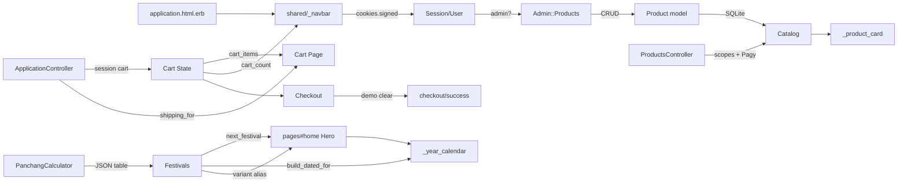

# Desi Saga — Knowledge Graph of Dependencies

> **Shared state map** — tracks the jobs (components/steps), arrows (handoffs/edges), and shared state (data flowing along the edges) of the Desi Saga product. Update this document every sprint (see `docs/ProjectToDos.md` §4.4).

## Component Dependency Map

```
app/views/layouts/application.html.erb ──→ shared/_navbar (auth + cart badge)   │ state: current_user via cookies.signed[:session_id]
app/controllers/application_controller.rb ─→ session[:cart] (server-side)        │ state: cart hash product_id → quantity
app/models/product.rb ──→ products table (SQLite, 17 categories + region)       │ state: catalog (images/tags/ritual_contents as JSON)
lib/panchang_calculator.rb ─→ data/festivals_generated_2026_2030.json (Option B) │ state: 14 bases × 5y Lahiri table + variant aliases
lib/festivals.rb ──→ PanchangCalculator (delegates + region alias)               │ state: Festival structs, days_left, next_festival
app/controllers/pages_controller.rb ─→ Festivals.next_festival + featured        │ state: hero countdown + year calendar (14 bases)
app/views/shared/_year_calendar.html.erb ─→ Festivals.build_dated_for(year)     │ state: dated cards + variant badges
app/views/pages/home.html.erb ─→ _festival_hero_image (per-category Pexels map) │ state: next_festival.category → hero image
app/controllers/products_controller.rb ─→ Product scopes + Pagy (12)             │ state: filtered grid, preserved params
app/views/shared/_product_card.html.erb ─→ ApplicationHelper#category_badge_class│ state: category → badge style + featured badge
app/controllers/carts_controller.rb + cart_items_controller.rb ─→ session[:cart] │ state: cart_items + cart_subtotal + shipping_for
app/controllers/checkouts_controller.rb ─→ session[:cart] → checkout/success     │ state: demo order (clears cart, no Stripe yet)
app/controllers/sessions_controller.rb + app/models/session.rb ─→ users table    │ state: bcrypt session cookie
app/controllers/admin/products_controller.rb ─→ Product CRUD + Pagy (20)         │ state: inventory grid, region select
app/helpers/application_helper.rb ─→ format_price (paise→₹), category_emoji/badge │ state: price/category display
app/helpers/icons_helper.rb ─→ inline lucide SVGs                                │ state: no icon gem
config/routes.rb ──→ constraints(host: /\Awww\./) → 301 → apex                   │ state: www→apex redirect (path preserved)
config/deploy.yml ─→ kamal-proxy hosts [apex, www] + SAN cert                   │ state: TLS + proxy routing
```

## Graph Representation



## Shared State Inventory

| State | Source | Consumers | Persistence |
|---|---|---|---|
| Cart items + qty | `ApplicationController#cart` (`session[:cart]`) | Navbar badge (`cart_count`), `carts#show`, `checkouts#show` | signed cookie session (4KB) |
| Cart totals + shipping | `cart_subtotal` + `shipping_for(≥₹999 free else ₹99)` | `carts/show`, `checkouts/show` | computed per request |
| Product catalog (23 hampers) | `products` table (`images/tags/ritual_contents` JSON, `region`) | `products#index` (Pagy 12), `products#show`, `pages#home` featured (4), `admin/products#index` (Pagy 20) | SQLite |
| Festival table (14 bases × 5y) | `data/festivals_generated_2026_2030.json` (Lahiri) via `PanchangCalculator` | `Festivals.next_festival`, `build_dated_for`, `_year_calendar` | JSON file |
| Next festival + days_left | `Festivals.next_festival(region:)` → `PanchangCalculator.next_festival` | Hero countdown (`pages/home`), navbar chip (`_navbar`), `Festivals.days_left` | computed daily |
| Category → badge/emoji | `ApplicationHelper#category_badge_class` / `category_emoji` | `_product_card`, `products/show`, `products/index` chips | helper hash |
| Auth session | `Session` model + `cookies.signed[:session_id]` via `Authentication` concern | `ApplicationController#current_user`, `_navbar` (Sign in/out + Admin), `Admin::BaseController` | DB + signed cookie |
| Admin credentials | `.env` (`ADMIN_EMAIL`/`ADMIN_PASSWORD`) → `db/seeds.rb` | `User#admin?` | env + `users` table |
| Pagination state | `Pagy` (`include Pagy::Backend/Frontend`) | `products#index` (12, overflow→p1), `admin/products#index` (20) | query params `?page=` + preserved `?category=&region=&q=&sort=` |

## Arrows (Handoffs)

| From | To | Trigger |
|---|---|---|
| Browse grid → Detail | `GET /products/:slug` (`products#show`) | click `_product_card` |
| Detail → Cart | `POST /cart_items` (`cart_items#create` → `add_to_cart`) | “Add to Cart” `button_to` |
| Cart qty → Cart | `PATCH /cart_items/:id` / `DELETE /cart_items/:id` | +/- / Remove `button_to` |
| Cart → Checkout | `GET /checkout` (`checkouts#show`) | “Checkout” link (redirects if empty with alert) |
| Checkout → Success | `POST /checkout` (`checkouts#create` clears `session[:cart]`) | “Place Order (Demo)” |
| Festival calendar → Catalog | `GET /products?category=` | click `_year_calendar` card |
| Hero “Shop <festival>” → Catalog | `GET /products?category=<next_festival.category>` | hero CTA |
| Catalog filters → Catalog | `GET /products?category=&region=&q=&sort=&page=` (Pagy preserves params) | category/region chips, search form, sort select, pagy nav |
| Navbar → Auth | `GET /login` (`sessions#new`) → `POST /session` | “Sign in” |
| Auth → Admin | `GET /admin` → `Admin::BaseController#require_admin` | “Admin” link (if `User#admin?`) |
| Admin form → Catalog | `POST /admin/products` / `PATCH /admin/products/:id` | create/update with `region`, `price_in_rupees` |
| Admin delete → Catalog | `DELETE /admin/products/:id` | “Delete” `turbo_confirm` |

## Change Log

| Date | Change | Author |
|---|---|---|
| 2026-09-01 | Production deploy: Hetzner CX23 `nbg1` `2.28.69.167`, Kamal SAN `desisaga.com + www`, www→apex 301 (`config/routes.rb:2`), grooming plan `grooming.md:1` (Phase 1 EPIC-6) | — |
| 2026-09-01 | Rails rewrite: session cart, Pagy, Option B Panchang (14 bases + variants), region column, shipping parity, param preservation | — |
| 2026-08-19 | Added auth graph (authOptions → NextAuth route → session → Navbar) and admin inventory graph (admin pages → CRUD API → products.json) | — |
| 2026-08-12 | Initial knowledge graph created from existing components | — |
